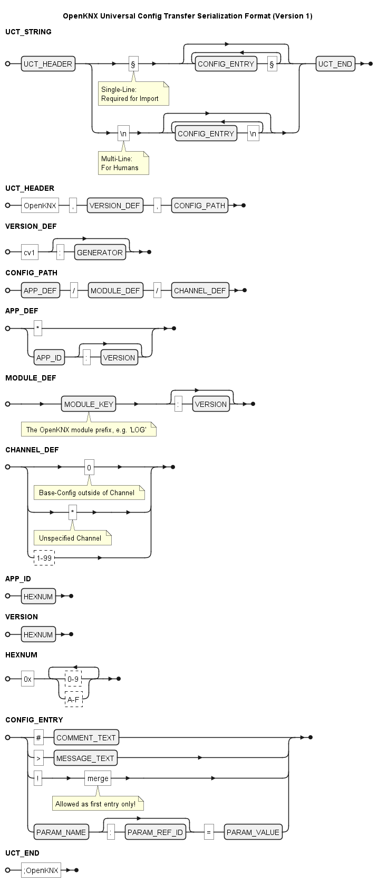

# Universal Configuration Transfer for OpenKNX Modules

Application Part for Export, Import, Copy and Cleanup of OpenKNX Modules Channel Configuration 

By Cornelius Koepp 2024

---

# Universeller Konfigurationstransfer für OpenKNX-Module

ETS-Anwendungsteil zum Exportieren, Importieren, Kopieren und Zurücksetzen der Konfiguration von OpenKNX-Modul-Kanälen

Von Cornelius Köpp 2024


## Inhaltsverzeichnis

> Eine [**Beschreibung des ETS-Applikationsteils** erfolgt in einem separaten Dokument](doc/Applikationsbeschreibung-ConfigTransfer.md)!

* [Konzepte](#konzepte)
  * [OpenKNX-Module und -Module-Kanäle](#openknx-module-und--module-kanäle)
  * [Serialisierung der Konfigurationsdaten als Zeichenkette](#serialisierung-der-konfigurationsdaten-als-zeichenkette)
* [Funktionen](#funktionen)
  * [Export](#export)
  * [Import](#import)
  * [Kanaltransfer](#kanaltransfer)
  * [Standardwerte](#standardwerte)
* [Geprüfte OpenKNX-Module](#geprüfte-openknx-module)
* [Integration in ETS-Applikation](#integration-in-ets-applikation)
  * [Voraussetzungen](#voraussetzungen)
  * [ApplikationName.xml](#applikationnamexml)
* (geplant) Beispiele
* [Formatspezifikation (Entwurf)](#formatspezifikation-entwurf)


# Konzepte


## OpenKNX-Module und -Module-Kanäle

Die ETS-Applikationen für OpenKNX-Geräte bestehen aus mehreren Teil-Applikationen die von den genutzten OpenKNX-Modulen bereitgestellt werden.
In den meisten Fällen sind die Module in der ETS direkt in der Block-Struktur einer Applikation sichtbar:

````
+----------------------------+  
| - # OpenKNX                +   \
+----------------------------+    |
|     # Allgemein            |    |  Modul "OpenKNX"
+----------------------------+     > nur Basiseinstellungen (kanalunabhängig)
|     = Erweitert            |    |  
+----------------------------+    |
|     ? Hilfe                |   /
+----------------------------+
| + # Konfigurationstransfer +   <-  dieses Modul (nur Basiseinstellungen, von Kanaltransfer ausgeschlossen )
+----------------------------+
| + # Beispie-Modul A        |
+----------------------------+
|   ...                      |
+----------------------------+
| - # Beispie-Modul I        |                                                    \  
+----------------------------+                                                     |
|     # Allgemein            |   \                                                 |
+----------------------------+     > Basiseinstellungen                            |
|       ...                  |   /                                                 |
+----------------------------+                                                     |
|     # Modul-Kanal 1        |   \                                                 |
+----------------------------+    |                                                |
|       ...                  |    |  kanalspezifische Einstellungen                |
+----------------------------+    |  (Anzahl Kanäle abhängig von Applikation)      |
|     # Modul-Kanal n        |   /                                                / 
+----------------------------+
|   ...                      |
+----------------------------+
| + # Beispie-Modul N        |
+----------------------------+
````

### Modul

> ***ACHTUNG***: Dieser Modul-Begriff weicht vom Konzept der ETS-XML-Module ab!

Ein OpenKNX-Modul stellt eine bestimmte abgrenzbare Funktionalität bereit,
die in vielen Fällen (aber nicht immer) in mehreren Applikationen eingesetzt werden kann.

Beispiele:

* Grundlegende Gerätekonfiguration (BASE aus OGM-Common) die in allen OpenKNX-Applikationen enthalten ist
* Logiken (LOG aus OFM-LogicModule) die in sehr vielen OpenKNX-Geräten enthalten sind
* Konfigurationstransfer (UCT aus OFM-ConfigTransfer, also dieses Modul selbst)


### Kanal

Ein OpenKNX-Modul kann mehrere Instanzen (von ConficTransfer werden bislang 99 unterstützt) der enthaltenen Funktionalität bereitstellen,
die unabhängig voneinander konfigurierbar sind. 
Darüber hinaus besitzen OpenKNX-Module eine "zentrale" Konfiguration die lost gelöst von einem einzelnen Kanal existiert.
Beim Konfigurationstransfer wird diese Basiskonfiguration als "Kanal 0" abgebildet. 

Beispiele:

* Logikkanäle innerhalb des Logik-Moduls, die jeweils z.B. eine UND-Verknüpfung oder Zeitschaltuhr abbilden.
* Die grundlegende Gerätekonfiguration und der Konfigurationstransfer enthalten keine Kanäle.


## Serialisierung der Konfigurationsdaten als Zeichenkette

Die Übertragung der Konfigurationsdaten erfolgt serialisiert als Zeichenkette.
Diese kann über die Zwischenablage mit der ETS-Applikation ausgetauscht werden. 
Zeichenvorrat und Codierungsverfahren erlauben eine unkomplizierte Übertagung über gängige Kommunikations-Kanäle, 
auch für Nicht-Entwickler.

ConfigTransfer-Strings haben eine leicht erkennbare Struktur:
```
OpenKNX,cv1,{R}§{E}§;OpenKNX
```

Durch Beginn einschließlich Format-Version und End-Markierung ist eine Erkennung und Prüfung auf Vollständigkeit möglich.
Der Referenz-Pfad (`{R}`) enthält Informationen über die ETS-Applikation, das Modul und den Modul-Kanal. 
Dadurch ist eine Zuordnung der Konfigurationsdaten möglich, sowie auch eine Kompatibilitätsprüfung zwischen Quell und Zielumgebung.
Die Konfigurationseinträge (`{E}`) enthalten Schlüssel-Werte-Paare basierend auf der Modul-internen repräsentation der Konfigurationsdaten.  

Details zum Format siehe Abschnitt [Formatspezifikation (Entwurf)](#formatspezifikation-entwurf).


## Funktionen


### Export
Exportieren eines Modul-Kanals (oder der Modul-Basiskonfiguration) in eine Zeichenkette. 

Der Export erfolgt in eine einzeilige (zum Import) oder mehrzeilige (zur Analyse) Zeichenkette in einem standardisierten und identifizierbaren Format.
Dieses enthält neben der individuellen Konfiguration auch folgende Informationen als Referenz:
* Applikations-ID und Applikations-Version der OpenKNX-Applikation
* Modul-Schlüssel und soweit vorhanden Modul-Version
* Kanal-Nummer (bzw. 0 für Modul-Basiskonfiguration)


### Import

Importieren eines Modul-Kanals (oder der Modul-Basiskonfiguration) aus einer Zeichenkette.

Der Import erfolgt aus einer einzeiligen Zeichenkette, die einem definierten Format entsprechen muss. 
Dieses ist erkennbar an der Struktur `OpenKNX,cv1 ... ;OpenKNX`
Daten in einer abweichenden, nicht unterstützten, Format-Version werden abgelehnt.

Zwingende Voraussetzung für einen Import ist ein übereinstimmender Modul-Schlüssel (Siehe Prefix in [Liste der OpenKNX Module](https://github.com/OpenKNX/OpenKNX/wiki/OpenKNX-Modules#liste-der-openknx-module)).
Eine abweichende Applikations-Version, Applikations-ID, oder Modul-Version kann ggf. ignoriert werden (unter Inkaufnahme von je nach Konstellation möglichen Ungenauigkeiten).
Die Kanal-Nummer kann automatisch aus dem Export übernommen, oder manuell - auch abweichend - gewählt werden. 


### Kanaltransfer

Kopieren der Konfiguration eines Kanals auf einen anderen Kanal desselben Moduls.


### Standardwerte

Partielles zurücksetzen auf Standardparameter eines einzelnen Modul-Kanals.

Durch die ETS-Funktion **Standardparameter** werden alle Parameter des Gerätes auf Standardwerte zurückgesetzt.
**Zurücksetzen** simuliert diesen Vorgang lokal beschränkt auf einen einzelnen Kanal eines Moduls.


#### Bekannte Limitationen

* Parameter mit Kanal-Spezifischen Werten können (bislang) nicht zurückgesetzt werden
* Es erfolgt kein (direkter) Schreibzugriff auf Parameter anderer Kanäle oder Module um deren Konfiguration nicht zu verändern. 
  Bei kanalübergreifenden Abhängigkeiten können Nebeneffekte jedoch nicht ausgeschlossen werden. 


## Geprüfte OpenKNX-Module

Die Implementation des Konfigurationstransfers unterstützt grundsätzlich jedes OpenKNX-Modul, 
das über den OpenKNXproducer in eine ETS-Applikation eingebunden werden kann, 
ohne dass dazu besondere Anpassungen vorgesehen sind.

Nutzung von nicht durch den Konfigurationstansfer unterstützten Konstrukten oder Limitationen der ETS können zu Einschränkungen führen.
Im Rahmen der Neuentwicklung von Applikationen mit integrierten Konfigurationstransfer, wurde die Funktion mit verschiedenen OpenKNX-Modulen getestet. 
Die Ergebnisse dieser Prüfungen sind soweit bekannt in der nachfolgenden tabellarischen Auflistung dokumentiert, 
im Fall von behebbaren Auffälligkeiten wird ggf. eine Korrektur des Moduls eingeplant.

| Modul              | Versionen  | Test   | Ergänzende Bemerkungen zur Prüfung                                                                                                                                                | ETS-Log       |
|--------------------|------------|--------|-----------------------------------------------------------------------------------------------------------------------------------------------------------------------------------|---------------|
| OGM-Common         | 1.2        | OK     |                                                                                                                                                                                   | -             |
| OFM-DFA            | 0.1        | OK     | Sehr lange Operationsdauern. In Tests bis zu 2 Minuten.                                                                                                                           | -             |
| OFM-Generic        | 0.1        | OK     |                                                                                                                                                                                   | -             |
| OFM-LogicModule    | 3.1<br>3.2 | OK*    | ***Bekannte Einschränkung:**<br>Der mehrzeilige Kanal-Kommentar kann bislang nicht übertragen werden. Dies ist bedingt durch die Einbindung als ETS-Modul.                        | WARN-Einträge |
| OFM-LogicModule    | 3.3        | OK     |                                                                                                                                                                                   | ?             |
| OFM-PresenceModule | 3.0        | OK     |                                                                                                                                                                                   | ?             |
| OFM-SensorModule   |            | OK     |                                                                                                                                                                                   | ?             |
| OFM-VirtualButton  | bis 0.4    | FEHLER | Nicht nutzbar in ETS5.7, durch Parameternamen die die beim Zugriff unterstützte Maximallänge überschreiten. Anpassung des Moduls erfolgt, so dass Folgeversionen kompatibel sind. | -             |
| OFM-VirtualButton  | 0.5        | OK     |                                                                                                                                                                                   | ?             |
| OFM-Meter          | 0.2        | OK     |                                                                                                                                                                                   | ?             |
| SOM-UP             | 1.0        | OK     |                                                                                                                                                                                   | ?             |


## Integration in ETS-Applikation

Zur Integration des Konfigurationstransfers muss nur die (mit dem [OpenKNXProducer](https://github.com/OpenKNX/OpenKNXproducer) erzeugte) OpenKNX ETS Applikation erweitert werden. 
An der Firmware ist zum aktuellen Zeitpunkt keine Anpassung erforderlich; dies kann sich mit zukünftigen Funktionserweiterungen jedoch noch ändern.


### Voraussetzungen

* Der [OpenKNXProducer](https://github.com/OpenKNX/OpenKNXproducer) wird in einer Version ab 3.2.1 (Release ab 3.3.4 empfohlen) benötigt um die Modulinformationen zur integrieren.


### ApplikationName.xml

An der gewünschten Stelle (z.B. hinter BASE) den folgenden Code einbinden:
```
  <op:define prefix="UCT"
             share="../lib/OFM-ConfigTransfer/src/ConfigTransfer.share.xml"
             ModuleType="19">
    <op:verify File="../lib/OFM-ConfigTransfer/library.json" ModuleVersion="0.1" /> 
  </op:define> />
```

# Formatspezifikation (Entwurf)
