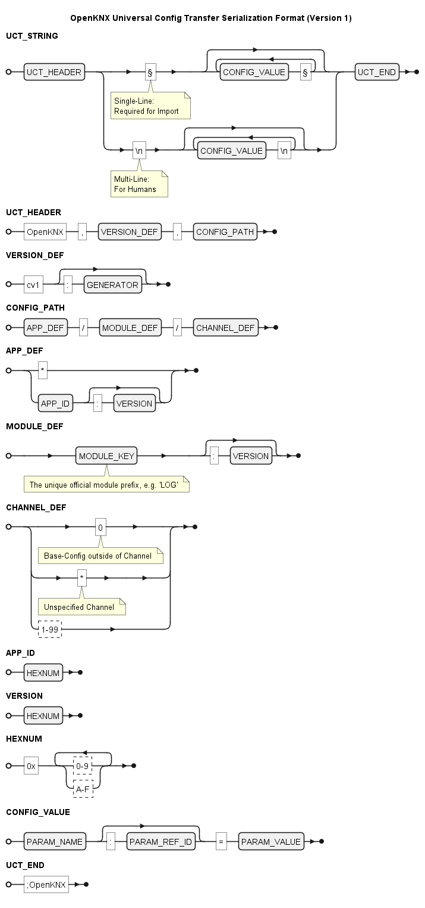

<!-- SPDX-License-Identifier: AGPL-3.0-only -->
<!-- Copyright (C) 2024 Cornelius Koepp -->
# Applikationsbeschreibung OFM-ConfigTransfer

# Inhaltsverzeichnis

* [Konzepte](#konzepte)
* ETS-Konfiguration:
  [**Konfigurationstransfer**](#ets-applikationsteilkonfigurationstransfer)
    * [**Hinweise &amp; Limitationen**](#hinweise--limitationen)
    * [**Import**](#import)
        * [Kompatibilitätsprüfung](#kompatibilitätsprüfung)
    * [**Export**](#export)
    * [**Kanalkopie**](#kanalkopie)
    * [**Standardwerte**](#standardwerte)

* [Kommunikationsobjekte](#kommunikationsobjekte)

# Konzepte

## OpenKNX: Module und Kanäle

Die ETS-Applikationen für OpenKNX-Geräte bestehen aus mehreren Teil-Applikationen die von den genutzten OpenKNX-Modulen bereitgestellt werden.

### Modul

> ***ACHTUNG***: Dieser Modul-Begriff weicht vom Konzept der ETS-XML-Module ab!

Ein OpenKNX-Modul stellt eine bestimmte abgrenzbare Funktionalität bereit, 
die in vielen Fällen (aber nicht immer) in mehreren Applikationen eingesetzt werden kann.

Beispiele:

* Grundlegende Gerätekonfiguration (BASE aus OGM-Common) die in allen OpenKNX-Applikationen enthalten ist
* Logiken (LOG aus OFM-LogicModule) die in sehr vielen OpenKNX-Geräten enthalten sind
* Konfigurationstransfer (UCT aus OFM-ConfigTransfer, also dieses Modul selbst)

### Kanal

Ein OpenKNX-Modul kann mehrere Instanzen (bis zu 999) der enthaltenen Funktionalität bereitstellen, 
die unabhängig voneinander konfigurierbar sind.

Beispiele:

* Logikkanäle innerhalb des Logik-Moduls, die jeweils z.B. eine UND-Verknüpfung oder Zeitschaltuhr abbilden.  
* Die grundlegende Gerätekonfiguration und der Konfigurationstransfer enthalten keine Kanäle.

## Konfigurationstransfer per Zeichenkette

Die Übertragung der Konfigurationsdaten erfolgt serialisiert:

# ETS-Applikationsteil: Konfigurationstransfer

## Hinweise &amp; Limitationen

### Modul-Version

Zeigt die Version im Format `Major.Minor` an.

### Hinweise

Wichtige Bemerkungen zum Einsatz dieses Moduls 

### Limitationen

Auflistung von bekannter Einschränkungen bei der Nutzung vom Konfigurationstransfer.

<!-- DOC -->
## Import

Erlaubt die Übernahme von Konfiguration ...

* ... aus anderen OpenKNX-Geräten
* ... aus Konfigurationsbeispielen
* ... von anderen OpenKNX-Nutzern
* ... aus externen Konfigurationstools

<!-- DOCCONTENT
### Importieren (Button)

Startet den Import mit den aktuellen Eingaben/Einstellungen.
Dieser Prozess kann u.U. mehrere Minuten in Anspruch nehmen und kann weder unterbrochen noch rückgängig gemacht werden!

> **ACHTUNG**: Vor dem Import sollte sichergestellt werden, dass durch Überschreiben des Zielkanals keine Konfigurationsdaten verloren gehen! 
DOCCONTENT -->

<!-- DOC -->
### Transfer-String

Hier muss die Zeichenkette mit der (serialisierten) Konfiguration in einem unterstützten Format eingegeben werden.
Diese Zeichenkette enthält u.A. auch eine Referenz auf das OpenKNX-Modul, in das die Konfiguration importiert wird.

Eine oberflächliche Formatprüfung stellt sicher, 
dass nur Eingaben angenommen werden die einen vollständigen ConfigTransfer-String enthalten *können*. 
Eine genaue Prüfung erfolgt jedoch erst nach dem Klick auf den Button *Importieren*.

> Exporte aus anderen ConfigTransfer-Versionen werden unterstützt, solange keine Änderung des Formats erfolgt.
  Abweichende Formatversionen werden hier noch nicht erkannt. 

<!-- DOC -->
### Import-Ziel

Legt fest, wohin innerhalb des Moduls importiert werden soll. 

#### automatisch aus Export übernehmen

Sorgt dafür, dass in denselben Kanal importiert wird, aus dem zuvor exportiert wurde. 
Voraussetzung dafür ist eine im Export-String enthaltene Kanal-Nummer.

Der Import mit dieser Einstellung wird scheitern, 
falls ein kanal-neutraler ConfigTransfer-String genutzt wird, 
oder eine Kanal-Nummer angegeben ist die in dieser Applikation nicht für das Modul definiert ist.  

#### Basiseinstellungen (kanalunabhängig)

Erzwingt, dass nur eine kanalunabhängige Konfiguration importiert wird.

Der Import mit dieser Einstellung wird scheitern,
falls ein kanal-bezogener oder kanal-neutraler ConfigTransfer-String genutzt wird.

#### n (1 bis 99)

Sorgt dafür, dass eine Kanal-Konfiguration in den gewählten Kanal importiert wird, 
unabhängig davon aus welchem Kanal sie exportiert wurde.

Der Import mit dieser Einstellung wird scheitern,
falls ein kanalunabhängiger ConfigTransfer-String genutzt wird,
oder eine Kanal-Nummer angegeben ist die in dieser Applikation nicht für das Modul definiert ist.

<!-- DOC -->
### Kompatibilitätsprüfung

Ein Konfigurationstransfer zwischen unterschiedlichen Applikationen birgt ein gewisses Risiko von unerwarteten Ergebnissen,
bedingt durch z.B. unterschiedliche KO-Nummern, veränderte Parameter, Parameterwerten und deren Interpretation innerhalb eines Moduls.

Durch das Level der Kompatibilitätsprüfung kann dieses Risiko, zu Lasten eines flexibleren Konfiguratrionstransfers, beschränkt werden.

#### streng       (selbe Modul- & ETS-App-Version)

Akzeptiert nur Importe, die aus exakt derselben Applikation mit exakt derselben Version stammen (und damit auch gleichzeitig dieselbe Modul-Version aufweisen).

Abgesehen von allgemeinen technischen Limitationen, bietet diese Einstellung die höchste Sicherheit einer unveränderten Konfigurationsübernahme,
bei Abweichungen in referenzierten Kanälen sind jedoch auch hier Einschränkungen möglich.

<!-- DOC Skip="4" -->
> Anwendungsszenarien:
> 
> * Verschiebung von einzelnen Funktionalitäten zwischen (von Applikationsseite) identischen OpenKNX-Geräten
> * Aktualisierung von einzelnen Funktionalitäten die identisch auf mehreren Geräten umgesetzt wurde (z.B. selbe Funktion in je einem Gerät pro Raum)

#### moderat   (selbe Modul-Version)

Akzeptiert Importe, solange diese aus derselben Modulversion stammen.

Diese Einstellung bietet immer noch eine hohe Sicherheit der korrekten Konfigurationsübernahme, 
solange die Kanal-Konfiguration keinen Bezug nach außen hat.
Erwartbare Einschränkungen sind z.B. Verknüpfungen zu internen KOs, die nicht mehr auf das erwarte Ziel zeigen, 
wenn KO-Nummern zwischen den beteiligten Applikation abweichen.

<!-- DOC Skip="4" -->
> Anwendungsszenarien:
> 
> * Verschiebung von einzelnen Funktionalitäten (oder Migration) zwischen verschiedenen OpenKNX-Applikationen derselben Generation (z.B. zwischen TP und IP, von OAM-LogicModule auf OAM-DFA oder OAM-PresenceModule)
> * Weitergabe von Konfigurationsbeispielen einer aktuellen Modul-Version

#### locker       (gleiche Parameternamen)

Versucht den Import durchzuführen, 
solange keine Parameternamen enthalten sind, die im Modul in dieser Applikation unbekannt sind.

Das wird in vielen Fällen immer noch zum gewünschten Ergebnis führen, 
wobei die in den anderen Stufen genannten Einschränkungen weiterhin gelten. 
Das Risiko von unerwarteten Effekten steigt mit dem Abstand zwischen den Versionen. 
Fälle in denen auch ein ETS-Upgrade möglich wäre bergen nur ein geringes Risiko.

Unter individueller Beachtung der Versionsunterschiede erlaubt diese Option eine sehr hohe Flexibilität.

<!-- DOC Skip="3" -->
> Anwendungsszenarien:
> * Verschiebung von einzelnen Funktionalitäten (oder Migration) zwischen sehr unterschiedlichen OpenKNX-Applikationen
> * Weitergabe von Versions-unabhängigen Konfigurationsbeispielen mit Bezug zu stabilen Konfigurationsoptionen

<!-- DOC -->
### Importieren (Button)

Startet den Import mit den aktuellen Eingaben/Einstellungen.
Dieser Prozess kann u.U. mehrere Minuten in Anspruch nehmen und kann weder unterbrochen noch rückgängig gemacht werden!

> **ACHTUNG**: Vor dem Import sollte sichergestellt werden, dass durch Überschreiben des Zielkanals keine Konfigurationsdaten verloren gehen! 

<!-- DOC -->
### Import-Resultat

Hier erfolgt eine Rückmeldung aus dem Import-Prozess. 
Bei Bedarf kann die Ausgabe in die Zwischenablage kopiert werden;
sobald einer der anderen Parameter auf dieser Seite verändert wird, 
wird der die Ausgabe geleert um Widersprüche zu den gewählten Einstellungen zu verhindern.  

Der Wert wird nicht weiterverarbeitet innerhalb der Applikation.

<!-- DOC -->
## Export

Erlaubt die Ausgabe von Konfiguration ...

* ... zur Übertragung in andere OpenKNX-Geräte
* ... zur Weitergabe an andere OpenKNX-Nutzer
* ... zur Sicherung/Dokumentation
* ... zur Nutzung in externen Tools

<!-- DOCCONTENT
### Exportieren (Button)

Startet den Export mit den aktuellen Einstellungen.
Dieser Prozess kann u.U. mehrere Minuten in Anspruch nehmen!
DOCCONTENT -->

<!-- DOC -->
### Modul

Wählt das Modul, aus dem die Konfiguration exportiert werden soll.
Die Modulbezeichnungen entsprechen der Beschriftung der Konfigurationsseiten innerhalb der ETS-Applikation.

Einzelne Module können vom Ersteller der Applikation von der Nutzung im Konfigurationstransfer ausgeschlossen worden sein.
Diese stehen dann nicht zur Auswahl. Das Modul Konfigurationstransfer selbst wird ebenfalls nicht zum Export angeboten.

<!-- DOC -->
### Inhalt/Kanal

Entscheidet welcher Teil der Modul-Konfiguration exportiert werden soll:

#### Basiseinstellungen (kanalunabhängig)

Exportiert Konfiguration die übergreifend für alle Kanäle wirkt, oder keinen Bezug zu einem Kanal besitzt.

Dieser Export ist immer möglich, selbst wenn keine entsprechende Konfigurationsmöglichkeit vorhanden ist.  

#### n (1 bis 99)

Sorgt dafür, dass die Konfiguration des Kanals mit der gewählten Nummer exportiert wird, 
sofern ein Kanal mit dieser Nummer existiert.

Der Export wird scheitern, 
falls das gewählte Modul keine Kanäle besitzt, oder keinen Kanal mit der entsprechenden Nummer.

<!-- DOC -->
### Exportierte Parameter

Legt fest in welchem Umfang Parameter in den Export aufgenommen werden sollen, 
die keinen aktuellen Einfluss auf die Konfiguration besitzen.

#### Standard (aktive mit individuellem Wert)

Exportiert nur solche Parameter, die aktuell in der ETS angezeigt werden und auf einen Wert haben der nicht dem Standard-Wert entspricht.
Frühere vorgenommene Einstellungen, die durch Änderung anderer Parameter ausgeblendet wurden, werden vom Export ausgeschlossen.

Diese Einstellung vermeidet, dass Altlasten in der Konfiguration weiterleben. 
Daraus resultiert im Ergebnis (bei erneutem Import) jedoch ein Verhalten, dass vom Quell-Gerät abweicht: 
Zuvor unsichtbare Parameter erhalten Ihren Standardwert und nicht mehr den zuletzt vergebenen.

#### auch inaktive/unsichtbare

Exportiert auch solche Parameter, 
die irgendwann mal auf einen Wert abweichend vom aktuellen Standardwert gesetzt wurden derzeit ausgeblendet/inaktiv sind.
Selbst wenn diese nicht gleichzeitig mit den eingeblendeten/aktiven Parametern wirksam sein können.

Diese Einstellung kann die Größe des Exports *erheblich* erhöhen, 
bietet jedoch auch die Möglichkeit um z.B. Konfigurationen für unterschiedliche Ausgangstypen alternativ abzubilden.

#### auch Standardwerte

Exportiert alle Parameter, die sichtbar sind, auch wenn sie auf den Standard-Wert gesetzt sind.

Diese Einstellung wird die Größe des Exports i.d.R. *erheblich* erhöhen,
kann jedoch helfen, wenn eine Übertragung in eine abweichende Modulversion mit veränderten Standardwerten erfolgen soll. 

<!-- DOC -->
### Format

Wählt die Form in der die Ausgabe erfolgt.
Diese hat keinen Einfluss auf den Inhalt des Exportes, 
legt jedoch fest welche Art der Weiterverarbeitung möglich ist.   

#### Standardformat (für Import)

Der Export erfolgt ohne Zeilenumbrüche in einer einzigen Zeile.
Dies ist zwingend erforderlich um die Ausgabe für den Import in einem andere Gerät nutzen zu können, 
da die ETS keine mehrzeitligen Eingaben unterstützt.  

#### Menschenlesbar/Mehrzeilig (für Analyse)

Der Export erfolgt mit einem Zeilenumbruch jeweils vor und nach jedem Konfigurationswert.
Dadurch ist der Inhalt für Menschen übersichtlicher und wesentlich einfacher zu erfassen,
insbesondere dann wenn innerhalb der Modul-Definition sprechende Parameternamen eingesetzt werden. 

Diese Darstellungsform kann z.B. in der Kommunikation mit Modul-Entwicklern genutzt werden

<!-- DOC -->
### Exportieren (Button)

Startet den Export mit den aktuellen Einstellungen.
Dieser Prozess kann u.U. mehrere Minuten in Anspruch nehmen!

<!-- DOC -->
### Export-String

Hier erfolgt die Ausgabe der serialisierten Konfigurationsdaten im gewählten Format.
Bei Bedarf kann die Ausgabe in die Zwischenablage kopiert werden.

Sobald einer der anderen Parameter auf dieser Seite verändert wird,
wird der Export-String geleert um Widersprüche zu den gewählten Einstellungen zu verhindern.

<!-- DOC -->
## Kanalkopie

Erlaubt die Vervielfältigung von Kanal-Konfigurationen, bzw. kann unterstützen bei der Reorganisation von Kanälen innerhalb eines Moduls.

### Modul

<!-- TODO Redundante Beschreibungen besser lösen -->
Wählt das Modul, zwischen dessen Kanälen die Konfiguration kopiert werden soll.
Die Modulbezeichnungen entsprechen der Beschriftung der Konfigurationsseiten innerhalb der ETS-Applikation.

Einzelne Module können vom Ersteller der Applikation von der Nutzung im Konfigurationstransfer ausgeschlossen worden sein.
Diese und auch Module ohne enthaltene Kanäle stehen nicht zur Auswahl.

### Quell-Kanal

Wählt den Kanal, der als Kopier-Vorlage dienen soll.

Die Kanalkopie wird scheitern, 
falls das gewählte Modul keine Kanäle besitzt, 
oder keinen Kanal mit der entsprechenden Nummer.

### Ziel-Kanal

Wählt den Kanal, der mit der Konfiguration des Quell-Kanals überschrieben werden soll.

Die Kanalkopie wird scheitern, 
falls das gewählte Modul keinen Kanal mit der entsprechenden Nummer besitzt,
oder der Ziel-Kanal identisch zum Quell-Kanal ausgewählt wurde.

### Kopieren (Button)

Startet den Kopiervorgang mit Überschreiben des Ziel-Kanals.
Dieser Prozess kann u.U. mehrere Minuten in Anspruch nehmen und kann weder unterbrochen noch rückgängig gemacht werden!

> **ACHTUNG**: Vor dem Kopieren sollte sichergestellt werden, dass durch Überschreiben des Ziel-Kanals keine Konfigurationsdaten verloren gehen!

### Kopier-Resultat

Hier erfolgt eine Rückmeldung aus dem Kopier-Prozess.
Bei Bedarf kann die Ausgabe in die Zwischenablage kopiert werden;
sobald einer der anderen Parameter auf dieser Seite verändert wird,
wird der die Ausgabe geleert um Widersprüche zu den gewählten Einstellungen zu verhindern.

Der Wert wird nicht weiterverarbeitet innerhalb der Applikation.

<!-- DOC -->
## Standardwerte

Erlaubt die Bereinigung von Kanal-Konfigurationen.

### Modul

<!-- TODO Redundante Beschreibungen besser lösen -->
Wählt das Modul, dessen Kanal auf Standardwerte zurückgesetzt werden.
Die Modulbezeichnungen entsprechen der Beschriftung der Konfigurationsseiten innerhalb der ETS-Applikation.

Einzelne Module können vom Ersteller der Applikation von der Nutzung im Konfigurationstransfer ausgeschlossen worden sein.
Diese und auch Module ohne enthaltene Kanäle stehen nicht zur Auswahl.

### Kanal

Wählt den Kanal, der mit Standardeinstellungen überschrieben werden soll.

Das Zurücksetzen des Kanals wird scheitern,
falls das gewählte Modul keinen Kanal mit der entsprechenden Nummer besitzt.

### Zurücksetzen (Button)

Startet das Überschreiben des ausgewählten Kanals mit Standardeinstellungen.
Dieser Prozess kann u.U. mehrere Minuten in Anspruch nehmen und kann weder unterbrochen noch rückgängig gemacht werden!

> **ACHTUNG**: Vor dem Kopieren sollte sichergestellt werden, dass durch Überschreiben des Ziel-Kanals keine Konfigurationsdaten verloren gehen!

### Resultat

Hier erfolgt eine Rückmeldung aus dem Rücksetz-Prozess.
Bei Bedarf kann die Ausgabe in die Zwischenablage kopiert werden;
sobald einer der anderen Parameter auf dieser Seite verändert wird,
wird die Ausgabe geleert um Widersprüche zu den gewählten Einstellungen zu verhindern.

Der Wert wird nicht weiterverarbeitet innerhalb der Applikation.

# Kommunikationsobjekte

Dieses Modul besitzt keine KOs.
